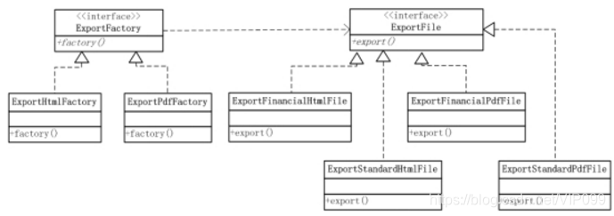

原文链接：https://blog.csdn.net/VIP099/article/details/107302255

拿导出功能来说。有这么一个需求：XX系统需要支持对数据库中的员工薪资进行导出，并且支持多种格式如：HTML、CSV、PDF等，每种格式导出的结构有所不同，比如：财务跟其他人对导出薪资的HTML格式要求可能会不一样，因为财务可能需要特定的格式方便核算或其他用途。

如果使用简单工厂模式，则工厂类必定过于臃肿。因为简单工厂模式只有一个工厂类，它需要处理所有的创建的逻辑。

假如以上需求暂时只支持3种导出的格式以及2种导出的结构，那工厂类则需要6个if else来创建6种不同的类型。如果日后需求不断增加，则后果不堪设想。

